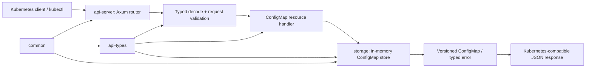

# Rusternetes: архитектура первого вертикального среза

**Статус:** утверждённая граница реализации фазы 1  
**Рабочая ветка:** `rusternetes/phase-1-api-storage`  
**Эталон:** Kubernetes commit `b3bc2ac58fa173967f27ade80f28cc5015b8c1c3` (локальный `upstream/master`, зафиксирован 18 августа 2026 года)

## Цель фазы

Первый вертикальный срез реализует минимальный, но рабочий Kubernetes-совместимый путь для **namespaced `ConfigMap`**: HTTP-запрос поступает в API Server, проходит маршрутизацию и серверную валидацию, изменяет типизированное хранилище и возвращает Kubernetes-подобный JSON-ответ. Срез включает `POST`, `GET`, namespace-scoped и all-namespaces `LIST`, `PUT` и `DELETE`, `metadata.resourceVersion`, условные обновления и удаления, полный equality/set-based селектор меток и field selectors `metadata.name`/`metadata.namespace` для `LIST`.

В этой фазе сознательно **не заявляется** реализация authentication, authorization, admission, WATCH, PATCH, статусов, контроллеров, scheduler, kubelet или CRD. Эти механизмы не создаются как пустые crates и не симулируются успешными ответами: для неохваченных путей сервер отвечает корректной ошибкой маршрутизации.

> Цель — не создать набор заготовок, а получить исполняемый путь `kubectl`-совместимого CRUD для одного типизированного ресурса с проверяемыми конкурентными гарантиями.

## Эталонные семантические контракты

| Контракт | Поведение фазы 1 | Эталонный исходный файл |
|---|---|---|
| Область `ConfigMap` | Ресурс доступен через `/api/v1/namespaces/{namespace}/configmaps` и cluster-wide list `/api/v1/configmaps`; namespace обязателен в объектном ключе, а URL namespace заполняет отсутствующее поле тела или требует совпадения | `pkg/registry/core/configmap/strategy.go`; официальная API documentation |
| Идентичность | Имя берётся из пути при `GET`, `PUT`, `DELETE`; тело `PUT` обязано содержать такое же `metadata.name` и `metadata.namespace` | `staging/src/k8s.io/apiserver/pkg/endpoints/handlers/update.go` |
| Создание | Дубликат `(namespace, name)` возвращает `409 Conflict`; сервер формирует `uid`, `creationTimestamp` и `resourceVersion` | `staging/src/k8s.io/apiserver/pkg/registry/rest/create.go` |
| Обновление | Если клиент передал `metadata.resourceVersion`, она обязана совпадать с текущей и иначе возвращается `409 Conflict`. Как и эталонный ConfigMap strategy, пустая версия допускает unconditional update. | `pkg/registry/core/configmap/strategy.go`, `staging/src/k8s.io/apiserver/pkg/registry/generic/registry/store.go` |
| Удаление | Объект отсутствует — `404`; заданные preconditions `uid` и/или `resourceVersion` проверяются атомарно и при несовпадении дают `409` | `staging/src/k8s.io/apimachinery/pkg/apis/meta/v1/types.go` |
| Валидация данных | Ключи `data` и `binaryData` валидируются как ConfigMap keys; множества ключей не пересекаются; `binaryData` декодируется из base64 | `pkg/apis/core/validation/validation.go` |
| Представление | Успешный ресурс имеет `apiVersion: v1`, `kind: ConfigMap`; список — `ConfigMapList` с `metadata.resourceVersion` | `staging/src/k8s.io/api/core/v1/types.go` |

## Архитектурный обзор и dependency graph

Весь изменяемый state принадлежит storage crate. API Server не получает доступа к его внутренним коллекциям: он работает только через типизированный `ConfigMapStore`. Это исключает разрозненные блокировки на уровне HTTP handlers и делает линейную точку каждой мутации явной.

## Cargo workspace и ответственность crates

На фазе 1 создаются только crates, участвующие в рабочем пути. Предварительное создание пустых `scheduler`, `kubelet`, `controller-manager` или `watch` намеренно запрещено: их границы будут проверены конкретными следующими вертикальными срезами.

| Crate | Ответственность в фазе 1 | Зависимости |
|---|---|---|
| `crates/common` | Структурированные ошибки API, преобразование в `Status`, общие идентификаторы и clock abstraction | `serde`, `thiserror`, `time` |
| `crates/api-types` | Типы `TypeMeta`, `ObjectMeta`, `ConfigMap`, `ConfigMapList`, `DeleteOptions`, валидация ConfigMap, label selectors и field selectors | `common`, `serde`, `uuid`, `time`, `base64` |
| `crates/storage` | Единственный владелец версии ресурса и ConfigMap state; атомарные create/update/delete/list/get | `api-types`, `common`, `tokio` |
| `crates/api-server` | Axum service, discovery и маршруты ConfigMap; преобразование typed errors в Kubernetes `Status` | `api-types`, `storage`, `common`, `axum`, `tokio`, `tower-http` |
| `integration-tests` | Исполняемые black-box HTTP тесты через `reqwest`, включая конкурентный конфликт | Все production crates, `reqwest` |

## Основные структуры данных

`ConfigMap` является отдельным типом Rust, а не `serde_json::Value`. Dynamic representation оставляется для будущего CRD-среза; она не нужна и не создаётся сейчас.

| Тип | Существенные поля | Инвариант |
|---|---|---|
| `ObjectMeta` | `name`, `namespace`, `uid`, `resource_version`, `generation`, `creation_timestamp`, labels, annotations, owner references, finalizers | После create `uid`, timestamp и resource version назначаются только сервером. |
| `ConfigMap` | `api_version`, `kind`, `metadata`, `immutable`, `data`, `binary_data` | `api_version == "v1"`, `kind == "ConfigMap"`; `data` и `binary_data` не имеют пересекающихся допустимых ключей. |
| `ConfigMapList` | type metadata, `ListMeta.resource_version`, `items` | Список возвращает согласованный storage revision. |
| `DeleteOptions` | `preconditions.uid`, `preconditions.resource_version` | Каждая указанная precondition сравнивается в той же критической секции, что и удаление. |
| `ApiStatus` | `status`, `reason`, `code`, `message`, details | Любая доменная ошибка отображается в Kubernetes-подобное тело ошибки, а не в строку или пустой ответ. |

## Модель concurrency и storage

`InMemoryConfigMapStore` использует один `tokio::sync::RwLock` **только как границу владения state storage**. Внутри находится `BTreeMap<ResourceKey, StoredConfigMap>` и возрастающий `u64` revision. Это не является глобальным паттерном синхронизации приложения: HTTP handlers, валидация и сериализация не удерживают lock.

Мутация выполняется в короткой write-секции: store читает текущий объект, проверяет existence и, если клиент передал версию или delete preconditions, сравнивает их с текущим объектом, увеличивает revision и коммитит новый объект или удаление. Поэтому create/update/delete имеют единственную линейную точку; две записи с одинаковой явно переданной прошлой версией не могут обе завершиться успехом. Пустая версия для `ConfigMap` означает unconditional update, как в эталонном `AllowUnconditionalUpdate`. `LIST` удерживает read lock лишь чтобы снять согласованный снимок map и revision, после чего фильтрует/сериализует вне write path.

`resourceVersion` является строковым представлением storage revision. Это осознанно ограниченная реализация первой фазы: его область действия ограничена одним процессом storage. Перезапуск не сохраняет revision; это несовместимость, которую устранит persistence-срез с durable backend до появления WATCH.

## HTTP и модель событий

API Server обеспечивает discovery (`GET /version`, `GET /api`, `GET /api/v1`), namespaced ConfigMap routes и cluster-wide list route. URL namespace становится server-owned scope: при отсутствии `metadata.namespace` сервер подставляет его, а при несовпадении body и URL возвращает typed validation error. Используются только явные resource paths; catch-all маршрут отсутствует, поэтому сервер не выдаёт фиктивный успех для неподдерживаемого API.

WATCH пока отсутствует. `?watch=true` возвращает Kubernetes-подобный `Status` с `404 NotFound` и причиной, описывающей отсутствие зарегистрированного resource handler, вместо имитации stream. Фаза 2 введёт журнал событий, compaction boundary, bounded subscriber queues, slow-consumer policy, `ADDED`/`MODIFIED`/`DELETED`/`BOOKMARK`/`ERROR`, начиная от уже проверенного transactional revision потока.

## Controller и scheduler model

В фазе 1 controllers и scheduler не запускаются. Их нельзя подключать без WATCH, work queue, retries и необходимой модели ресурсов. Для последующих срезов storage change-log будет единственным источником упорядоченных событий, а controller runtime будет владеть очередью и backoff-state для ключей ресурсов. Scheduler получит отдельную queue и typed extension traits только после появления Pod, Node и binding API.

## Стратегия совместимости

| Уровень | Фаза 1 | Граница совместимости |
|---|---|---|
| Tier 1: resource model и CRUD | ConfigMap JSON, namespaced и all-namespaces list paths, Kubernetes API errors, create/get/list/update/delete, UID, labels, field selectors и optimistic concurrency | Поддержан для выбранного ресурса; `PATCH`, finalizer workflow и status subresource ещё не поддержаны. |
| Tier 2: клиентский доступ | HTTP-discovery и формы ответов, необходимые для прямого Kubernetes API client и части `kubectl` operations | Совместимость будет доказана integration test с реальным `kubectl`, если бинарник доступен в окружении. |
| Tier 3: экосистема | Не заявляется | Требует WATCH, admission, RBAC, controllers и persistence. |

## Архитектурные компромиссы фазы 1

| Решение | Причина | Последствие и план устранения |
|---|---|---|
| In-memory storage | Позволяет проверить HTTP, типы, validation и optimistic concurrency без ложно заявленной production durability | Не переживает рестарт и не поддерживает distributed consistency; следующий storage-срез выберет и интегрирует durable backend. |
| Один typed resource (`ConfigMap`) | Это полный рабочий вертикальный путь вместо набора незавершённых API | Модель registry должна стать расширяемой до добавления Service, Pod и Deployment. |
| Один storage lock | Малая критическая секция сохраняет атомарность при простом, проверяемом state owner | Не предназначено для высоконагруженного production deployment; partitioning проводится только после benchmark. |
| Нет authentication/authorization | Нельзя имитировать безопасность «разрешить всё» как production readiness | Сервер первой фазы предназначен только для loopback/integration use; security pipeline будет добавлена до внешнего deployment. |
| Нет WATCH | Не выдаётся ложный streaming endpoint без backpressure, compaction и ordering guarantees | WATCH — отдельный вертикальный срез фазы 2, построенный поверх durable revisions. |

## Критерии готовности фазы 1

Реализация принимается только при наличии production path во всех четырёх crates, unit tests для validation/selectors/storage и black-box integration tests для HTTP CRUD, duplicate create, stale update с явно переданной версией, unconditional update без версии, conditional delete, label-filtered list и unknown resource path. Обязательны успешные `cargo fmt --check`, `cargo check --workspace`, `cargo test --workspace` и `cargo clippy --workspace -- -D warnings`.

## Локальные ссылки на эталон

1. `staging/src/k8s.io/apiserver/pkg/registry/rest/{create,update,delete,rest}.go`
2. `staging/src/k8s.io/apiserver/pkg/endpoints/handlers/{create,update,delete,watch}.go`
3. `pkg/registry/core/configmap/{strategy.go,storage/storage.go}`
4. `pkg/apis/core/validation/validation.go`
5. `staging/src/k8s.io/api/core/v1/types.go`
6. `staging/src/k8s.io/apimachinery/pkg/apis/meta/v1/types.go`

Все пути относятся к зафиксированному commit, указанному в начале документа.
